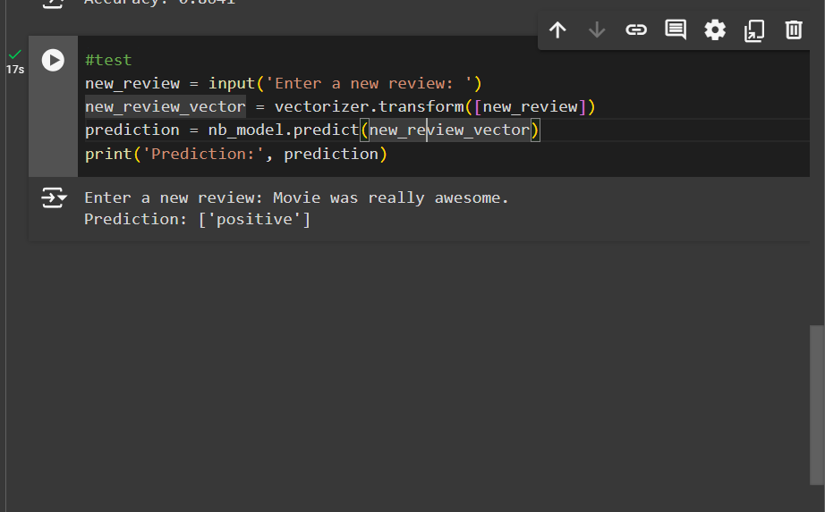

# CODTECH-INTERSHIP
NAME: SOAN DIAZ  E S  
COMPANY: CODTECH IT SOLUTIONS PVT.LTD  
ID: CT6WDS1254  
DOMAIN: MACHINE LEARNING  
DURATION: 6 WEEKS from JULY 10th, 2024 to AUGUST 25th, 2024.  
MENTOR: NEELA SANTHOSH KUMAR  

## Overview of project  
Analysis on  Movie Review  

### Objective  
Developed a sentiment analysis model to classify movie reviews as positive or
negative. Used a dataset IMDb Movie Reviews dataset for training and
testing.  
### Key Activities  
Preprocess text data  
Split dataset into training and testing sets  
Create TF-IDF vectorizer  
Fit and transform training data  
Train Naive Bayes model  
Testing  
### Technologies Used  
Python: The programming language used.  
pandas: Used loading the csv file and data manipulation.  
numpy: Used to work with arrays.  
nltk: Symbolic and statistical natural language processing (NLP) for English written in the     Python programming language.   
sklearn: Statistical modeling including classification, regression, clustering and dimensionality reduction.  

